# conv-net-viz

Assignment to re-implement
```
Zeiler, M.D. and Fergus, R., 2014, September. Visualizing and understanding convolutional networks. In European conference on computer vision (pp. 818-833). Springer, Cham. Cited by 2457
```

# Convents on my agenda

Nets addressed so far:
- [Alex](#alexpy)
- [VGG](#vggpy)

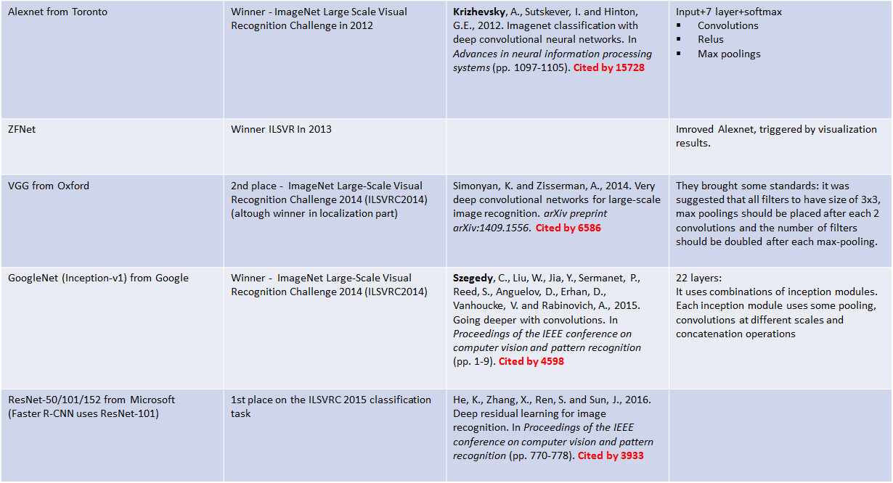

# Scripts

## simple.py
Visualization for a very small network from: https://github.com/aymericdamien/TensorFlow-Examples/
Python3.5, CUDA 8, Tensorflow 1.0
```
$ python simple.py
$ firefox simple.html // for layer-1 analysis
$ firefox simple2.html // for layer-2 analysis
```
Screenshots:

Layer-1 convolution output
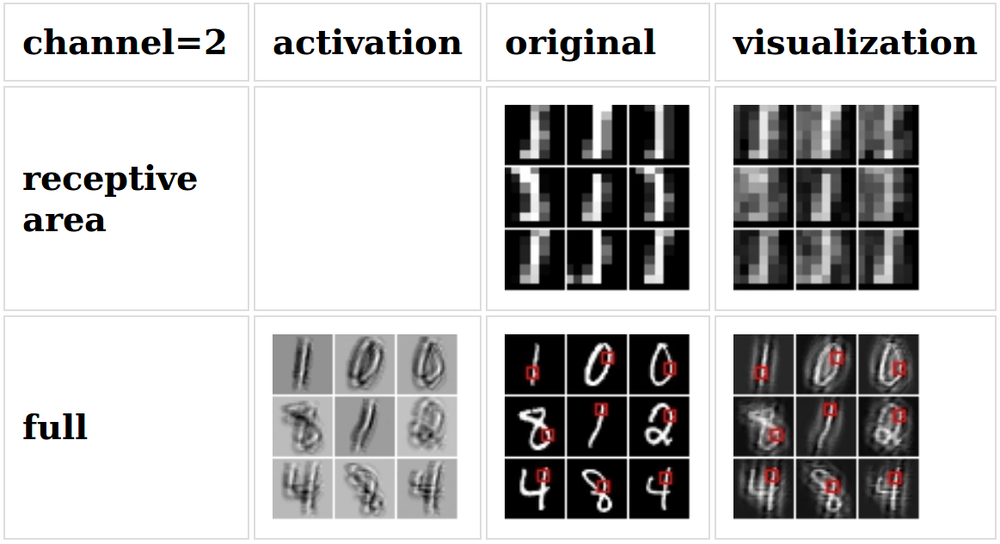

Layer-2 convolution output
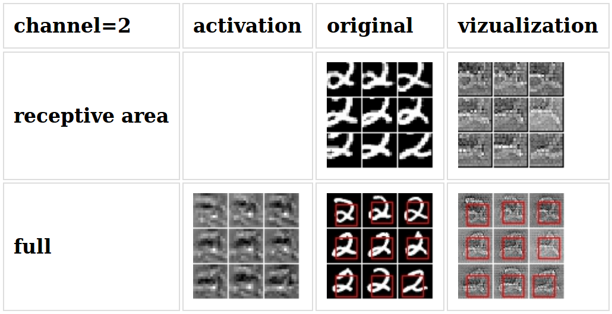

Download full html pages in zip:
[ZIP](https://drive.google.com/file/d/0BwTp6MaUSAahLUYwbzgtTFJ3Tkk/view?usp=sharing)

Graph:
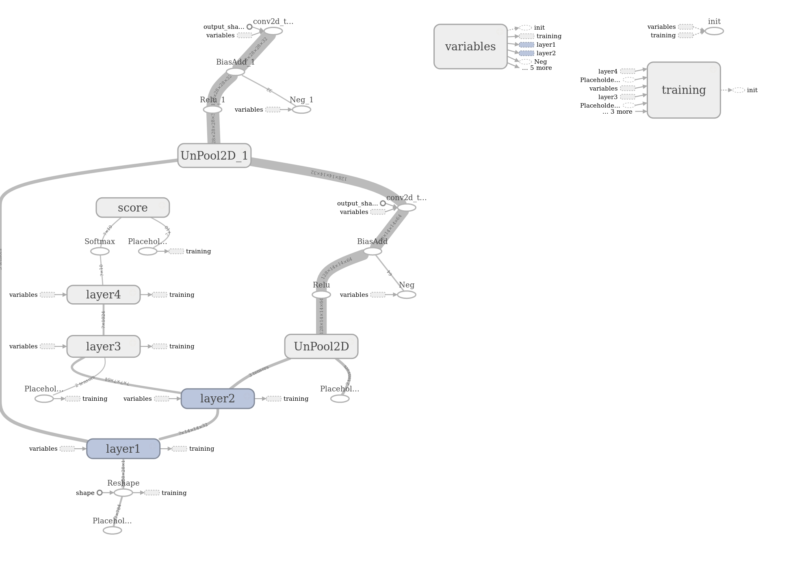

## alex.py
Visualization for the Alex network from: http://www.cs.toronto.edu/~guerzhoy/tf_alexnet/ (converted from caffe)

First, please, download their weights:
```
$ wget http://www.cs.toronto.edu/~guerzhoy/tf_alexnet/bvlc_alexnet.npy
```

To run the visualisation: (first couple channel is displayed, but you can increase the number of channels with: 'max_channel_num' variable in the constructor)
```
$ python alex.py
$ firefox alex.html // for layer-1 analysis
$ firefox alex2.html // for layer-2 analysis
$ firefox alex3.html // for layer-3 analysis
$ firefox alex4.html // for layer-4 analysis
$ firefox alex5.html // for layer-5 analysis
```

Download full html pages for the first5 channel in each conv in zip:
[ZIP](https://drive.google.com/open?id=1i3x78wTukS6eHTTvl3pwbObymNNdhFZd)

Screenshots:

Layer-1 convolution output
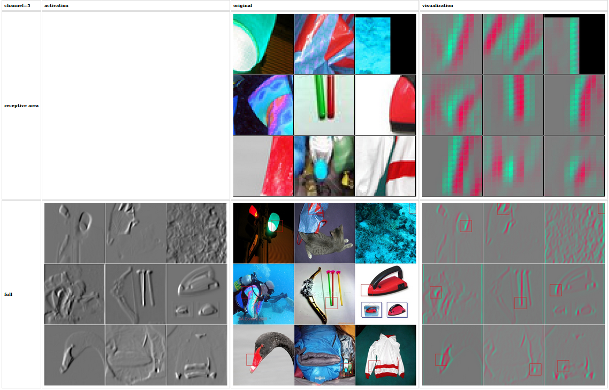
Layer-2 convolution output

Layer-3 convolution output (tends to react on dog, or dog hair? or dog eye?)
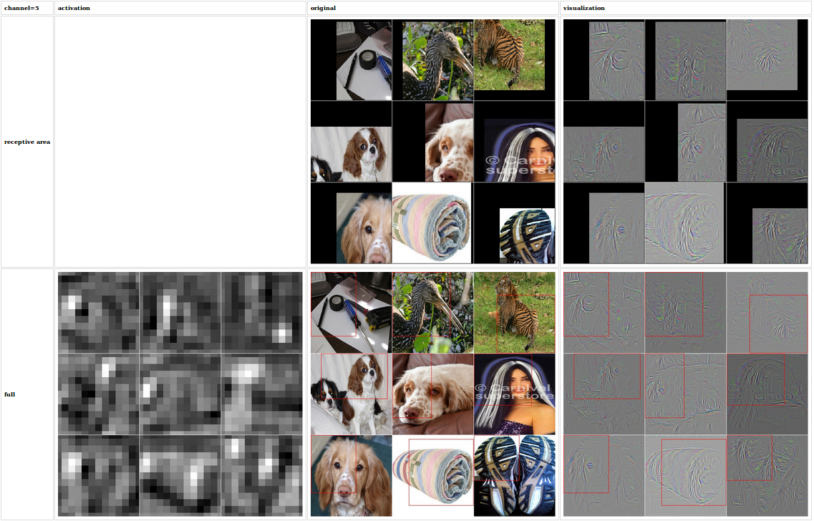
Layer-4 convolution output, channel 5: dark circle, NOTE: now activation map has a spatial info about the circle
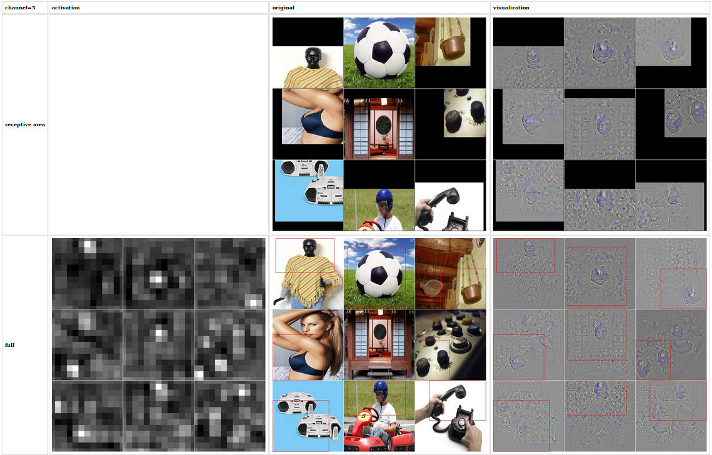
Layer-4 convolution output, channel 2: flower, petals
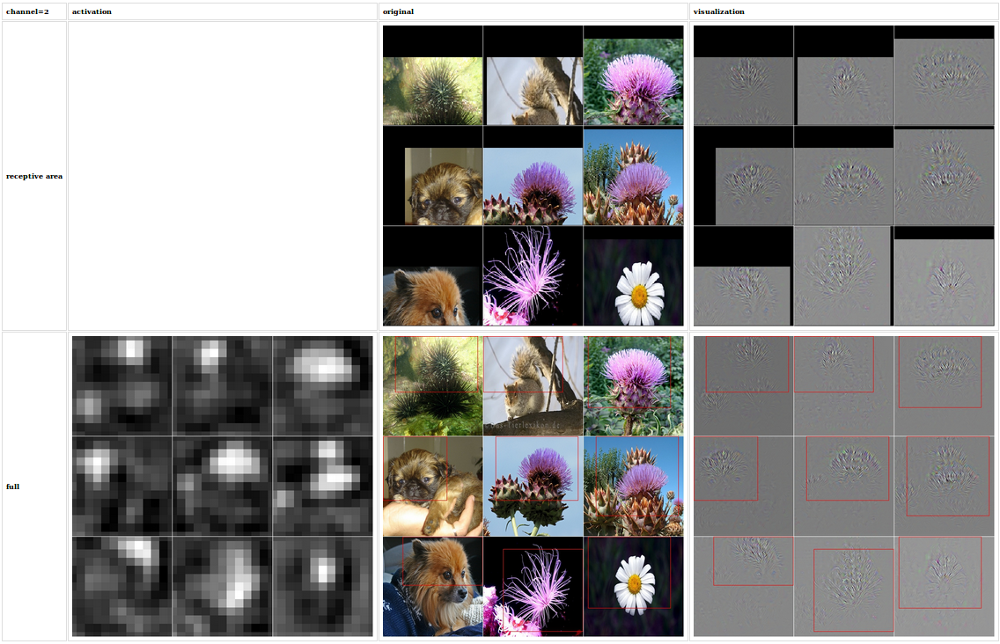
Layer-5 convolution output blue bird, NOTE: the best 9 images are displayed (from 8192 images) At this depth not all the 9 is good. Log reveals that the first 3 images outstand with value around 160.
Change DB.limit_len(8192) for more pictures
```
	Layer=Tensor("layer5/Conv2D:0", shape=(?, 13, 13, 128), dtype=float32)
	Visualizing channel= 5
		Top indices=[6040 3750  317 5461 3286  886 1203 6144 1676]
		np.max(activation_data) for all image on channel_5 =160.986
		np.min(activation_data) for all image on channel_5 =-47.1801
		layer5/Conv2D:0 has a non zero siblings=1
		 filling sibling reverse tensor with zeros= split:1
		 prep_for_save_activation_image>
		 out_shape=[9, 227, 227, 3]
		 td_shape=(9, 13, 13, 128)
		 zooming to activation by factor=17.4615384615
		 max activation at layer          = 0 is at (4, 6, 160.98637)
		 max activation projected to image= 0 is at (69, 104, 160.98637)
		 max activation at layer          = 1 is at (7, 3, 157.32617)
		 max activation projected to image= 1 is at (122, 52, 157.32617)
		 max activation at layer          = 2 is at (6, 6, 148.83383)
		 max activation projected to image= 2 is at (104, 104, 148.83383)
		 max activation at layer          = 3 is at (6, 7, 131.48227)
		 max activation projected to image= 3 is at (104, 122, 131.48227)
		 max activation at layer          = 4 is at (11, 3, 128.53893)
		 max activation projected to image= 4 is at (192, 52, 128.53893)
		 max activation at layer          = 5 is at (4, 10, 123.52438)
		 max activation projected to image= 5 is at (69, 174, 123.52438)
		 max activation at layer          = 6 is at (6, 7, 122.13692)
		 max activation projected to image= 6 is at (104, 122, 122.13692)
		 max activation at layer          = 7 is at (0, 8, 120.66075)
		 max activation projected to image= 7 is at (0, 139, 120.66075)
		 max activation at layer          = 8 is at (0, 6, 115.81746)
		 max activation projected to image= 8 is at (0, 104, 115.81746)
```
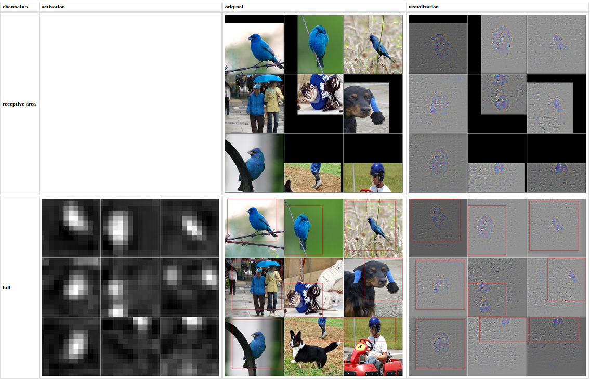

## vgg.py

Visualization for the VGG network from: http://www.cs.toronto.edu/~frossard/post/vgg16/ (converted from caffe)

First, please, download their weights:
```
$ wget https://www.cs.toronto.edu/~frossard/vgg16/vgg16_weights.npz
```

To run the visualisation: (first couple channel is displayed, but you can increase the number of channels with: 'max_channel_num' variable in the constructor)
```
$ python vgg.py
$ firefox vgg.html // for layer-1 analysis
$ firefox vgg2.html // for layer-2 analysis
```

Screenshots:

Layer-1 convolution output
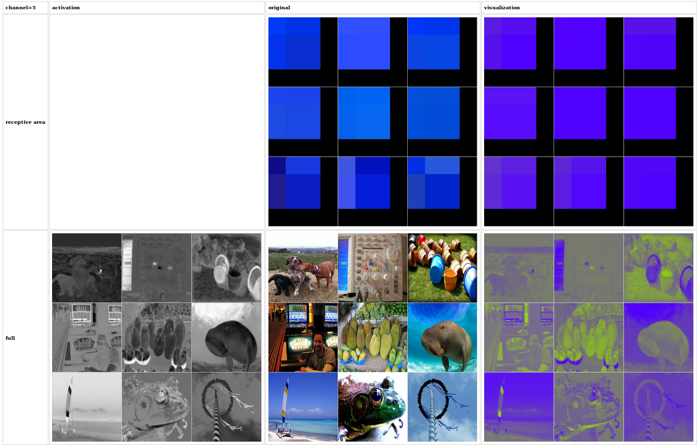
Layer-2 convolution output
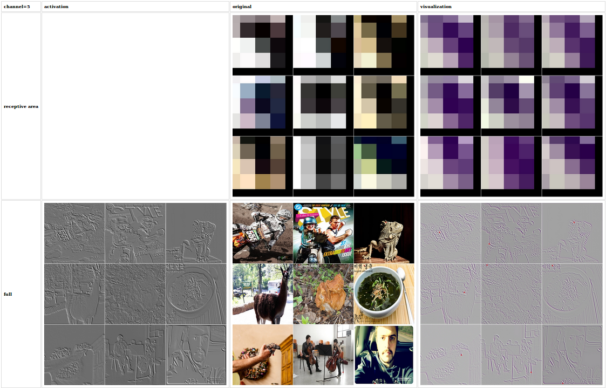
Layer-2 maxpool output
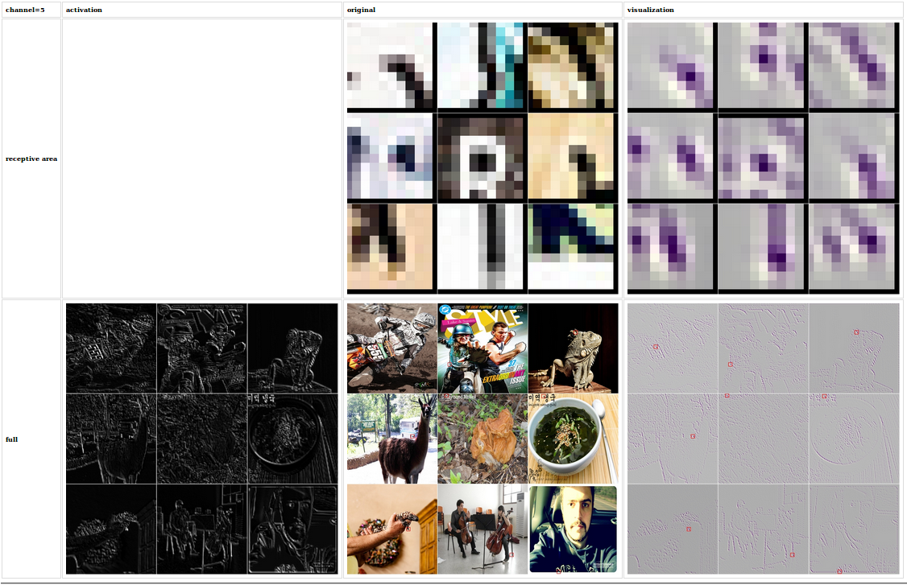


# Preliminary tests
I experienced what conv2d_transpose is doing exactly

Most inspiring resource: <https://github.com/simo23/conv2d_transpose/blob/master/test.py>
```
$ ut_shape.py
$ ut_conv.py
$ ut_one_layer.py
```
Last scripts reconstructs 5th channel (this script is mainly from the cited resource)
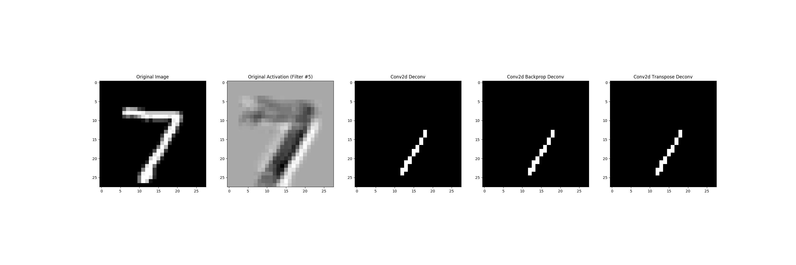